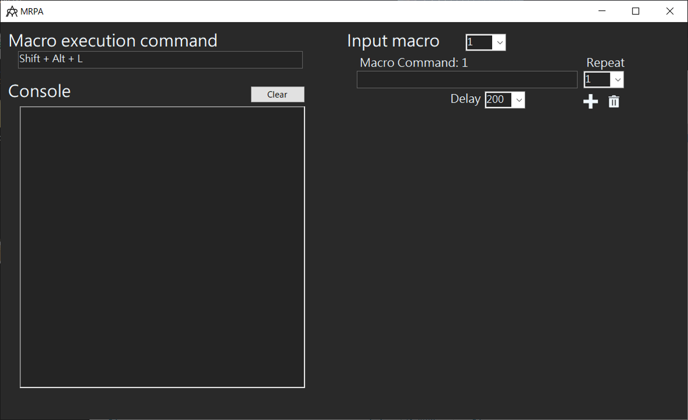
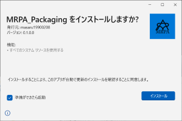
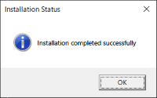
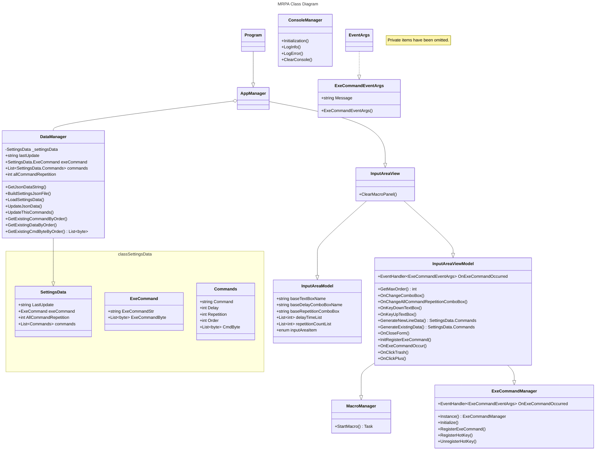

<h1 align="center">
  <br>
  <a href=""></a>
</h1>



## What is MRPA

- Abbreviation for Mini Robotic Process Automation.
- This application allows you to automate operations at any desired timing, similar to RPA, by pre-programming keyboard commands.
- As long as this application is running, keyboard commands can be executed in any scenario.

## Operating environment

- Windows 10 22H2 (19045)
  - I have not tested it in any other environment, so we do not guarantee it in other environments.

## Attention

- The developer will not be held responsible for any damages caused by this application.
- I recommend using it after understanding that it is for personal development and that there are some risks involved.

## Attention (JP)

- 開発者は、本アプリケーションによって生じた損害について、一切の責任を負いません。
- 自己啓発のためのものであり、リスクもあることを理解した上で利用することをお勧めします。
  
## How To Use

1. Enter any keyboard command in the `Macro Command` text box in the `Input Macro` field.
    - Some keyboard commands such as `Alt + Tag` are not supported.
    - For more information, please check the release details available from the [download link](#download).
1. `The Delay` drop-down allows you to set the interval before the next keyboard command is executed.
1. `The Repeat` drop-down is useful if you want to execute the keyboard command you have entered multiple times.
1. The drop-down menu `next to Input Macro` is useful for repeating the entire keyboard command you have entered.
1. `The plus button` adds a new line below the line you pressed.
1. `The trash button` deletes the line you press.
1. When you have finished entering all the data, enter the `Macro execution command` using your own keyboard.
    - When executing this command, it is not necessary for MRPA to be in the foreground, so please execute it on any application such as Excel.

※ The `Macro execution command` can be changed, but we recommend that you do not change it to avoid malfunctions or overlap with other shortcuts.

## How To Use (JP)

1. `Input Macro`欄の`Macro Command`テキストボックスに任意のキーボードコマンドを入力する。
    - `Alt + Tag`などの一部のキーボードコマンドはサポートされていません。
    - 詳しくは[ダウンロードリンク](#download)から確認できるリリース詳細を参照ください。
1. `Delay`のドロップダウンは次のキーボードコマンドを実行するまでの間隔を決定することができます。
1. `Repeat`のドロップダウンは入力したキーボードコマンドを複数回実行したい場合に便利です。
1. `Input Macroの横`にあるドロップダウンは入力したキーボードコマンド全体を繰り返し実行する場合に便利です。
1. `プラスボタン`は押した行の下に新たな行を追加します。
1. `ゴミ箱ボタン`は押した行を削除します。
1. 全ての入力が完了したら`Macro execution command`のキーボード入力を自身のキーボードで入力します。
    - このコマンドを実行する際にMRPAが最前面にある必要はなく実行さえされていればよいのでExcel等任意のアプリケーション上で実行してください。

※ `Macro execution command`は変更が可能ですが誤作動や他のショートカットとかぶらないように変更しないことを推奨します。

## Download

- You can download an installable version [here](https://github.com/masaru19900208/MRPA/tags).

## Install

1. Download MRPA_Package.zip from the latest version of the [download link](#download).
1. Unzip the downloaded MRPA_Package.zip file directly to the C drive *1.
1. Run the Install.bat file with **administrator privileges**.
    - If you do not run it with administrator privileges, the process will fail partway through, so please close the window and run the `Installer.bat` file again with administrator privileges.
1. AppInstaller will start, so click the install button.
    - 
1. When the installation is complete, the following window will appear, so click OK.
    - 
1. Clicking OK will delete the files used for the installation and complete all installation processes.
    - If it is not deleted automatically, please delete it manually. Even if it remains, it won't do any harm, but it is recommended to delete it as it is in the way.

*1: Unzip directly under the C drive will result in the following structure.

```text
C:\
└ MRPA_Package
    ├ MRPA_Packaging.appinstaller
    ├ Installer.bat
    └ MRPA_Packaging_{latest_version}_Test
        ├ MRPA_Packaging_{latest_version}_x64.cer
        └ MRPA_Packaging_{latest_version}_x64.msixbundle
```

## Install (JP)

1. 最新バージョンの[ダウンロードリンク](#download)からMRPA_Package.zipをダウンロードする。
1. Cドライブ直下にMRPA_Package.zipを解凍する。*1
1. 解凍ファイル内にあるInstall.batを**管理者権限で実行**する。
    - 管理者権限で実行しなかった場合はプロセスが途中で失敗するので、一度ウィンドウを閉じ改めて管理者権限で実行する。
1. アプリインストーラが起動するのでインストールボタンをクリックする。
    - 
1. アプリケーションのインストールが完了すると以下のウィンドウが出現するのでOKをクリックする。
    - 
1. OKをクリックすることでインストールに使用したファイルの削除を実施しすべてのインストール工程が完了する。
    - もしファイルが削除されなかったら手動で削除してください。ファイルが悪さをすることはありませんが邪魔なので削除を推奨します。

*1: Cドライブ直下に解凍すると、以下のファイル構造になります。

```text
C:\
└ MRPA_Package
    ├ MRPA_Packaging.appinstaller
    ├ Installer.bat
    └ MRPA_Packaging_{latest_version}_Test
        ├ MRPA_Packaging_{latest_version}_x64.cer
        └ MRPA_Packaging_{latest_version}_x64.msixbundle
```

## Class diagram

I created a class diagram after implementing the code and realized that I hadn’t followed the MVVM pattern. I'm quite shocked.



## Goals of this project

- To give form to the results of my training.
- To deepen my understanding by materializing what I have learned.
- To create an application that can be completed within the remaining training period.
- To fully utilize the knowledge and skills acquired during the training.

## Not a goal of this project

- To use this application in business after the training ends.
- To acquire users for the application.
- To create an application with a focus on ease of use and excellent UX.

##
