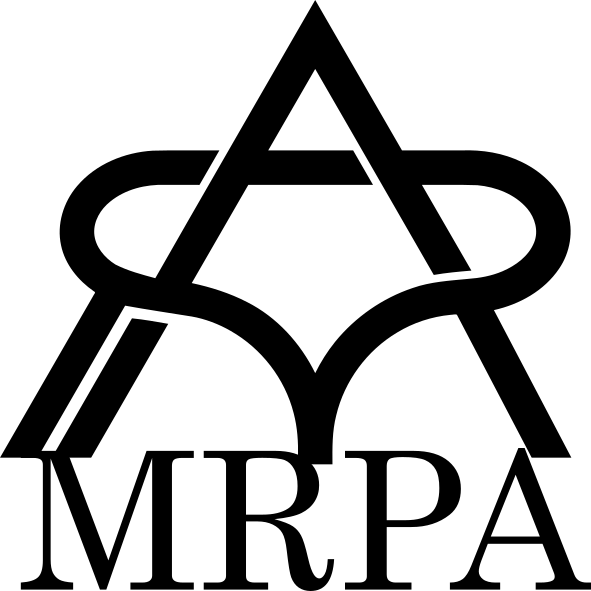

<h1 align="center">
   
  
</h1>

## What is MRPA

- Abbreviation for Mini Robotic Process Automation.
- This application allows you to automate operations at any desired timing, similar to RPA, by pre-programming keyboard commands.
- As long as this application is running, keyboard commands can be executed in any scenario.
- Note that some keyboard commands are not supported, so caution is required.

## How To Use

1. Install (**Prepared in the future.**)
1. Enter any keyboard command in the `Input macro` text box.
    - There are some keystrokes that are not supported, such as “Alt + Tag”.
1. Execute the command `Macro execution command`.

## Download

- You can download an installable version **in the future**.

## Class diagram

- I'll put it up eventually.

## Goals of this project

- To give form to the results of my training.
- To deepen my understanding by materializing what I have learned.
- To create an application that can be completed within the remaining training period.
- To fully utilize the knowledge and skills acquired during the training.

## Not a goal of this project

- To use this application in business after the training ends.
- To acquire users for the application.
- To create an application with a focus on ease of use and excellent UX.

##
